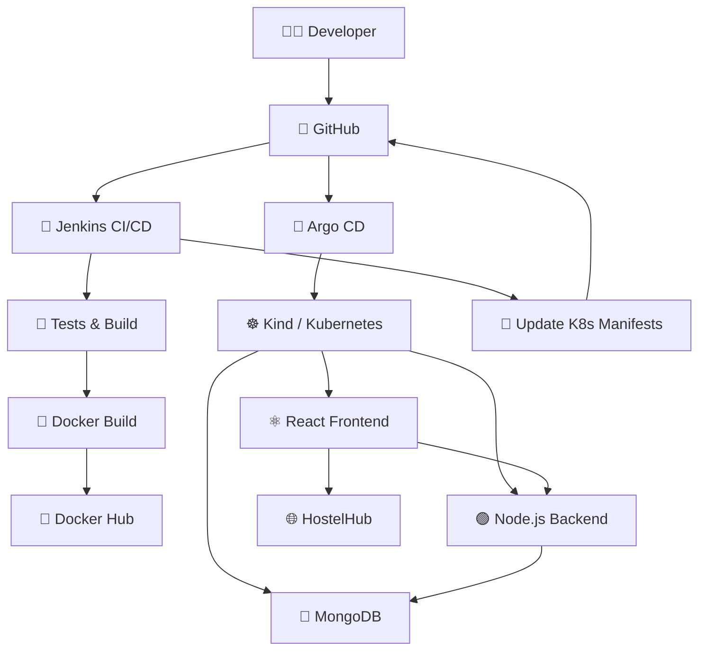

# 🏠 Hostel Management System — CI/CD + GitOps

A full-stack **Hostel Management System** deployed with a DevOps workflow using **Jenkins CI/CD, Docker, Docker Hub, Kubernetes (Kind), and Argo CD GitOps** on an AWS EC2 instance.

The application provides a dashboard for managing hostel residents/students, rooms, and related information. The frontend, backend, and MongoDB database are containerized/deployed as separate Kubernetes workloads.

> **Current status:** Jenkins CI/CD and Argo CD GitOps are working. GitHub webhook automation is intentionally not configured yet; Jenkins is currently triggered manually with **Build Now**.

---

## 🚀 Project Overview

This project demonstrates the complete flow from source code to a running Kubernetes application:

```text
👨‍💻 Developer
      │
      ▼
🐙 GitHub
      │
      ▼
🔨 Jenkins
      │
      ├── 🧪 Backend Test
      ├── ⚛️ Frontend Build Test
      ├── 🐳 Docker Build
      ├── 🐳 Docker Push
      └── 📝 Update Kubernetes Manifests
                │
                ▼
             🐙 GitHub
                │
                ▼
            🚀 Argo CD
                │
                ▼
          ☸️ Kubernetes / Kind
          ┌─────┼─────┐
          ▼     ▼     ▼
       ⚛️ UI  🟢 API  🍃 DB
```

---

# 🧰 Technology Stack

| Category | Technology |
|---|---|
| Cloud | ☁️ AWS EC2 |
| Operating System | 🐧 Ubuntu |
| Source Control | 🐙 Git / GitHub |
| Frontend | ⚛️ React |
| Backend | 🟢 Node.js |
| Database | 🍃 MongoDB |
| CI/CD | 🔨 Jenkins |
| Containerization | 🐳 Docker |
| Container Registry | 🐳 Docker Hub |
| Orchestration | ☸️ Kubernetes |
| Kubernetes Environment | 🧩 Kind |
| GitOps | 🚀 Argo CD |
| Web Server | 🌐 Nginx |

---

# ✨ Application Features

- 🏠 Hostel management dashboard
- 👨‍🎓 Student/resident management
- 🚪 Room management
- 🔎 Student search
- ➕ Add student
- 🗑️ Remove student
- 📊 Resident and room statistics
- 🍃 MongoDB data storage
- ⚛️ React frontend
- 🟢 Node.js backend

---

# 🏗️ Project Architecture



---

# 🔄 CI/CD Pipeline

The Jenkins pipeline contains the following major stages:

```text
1. Declarative: Checkout SCM
              ↓
2. Checkout
              ↓
3. Backend Test
              ↓
4. Frontend Build Test
              ↓
5. Docker Build
              ↓
6. Docker Push
              ↓
7. Update Kubernetes Manifests
              ↓
8. Declarative: Post Actions
```

### Jenkins responsibilities

Jenkins:

- Checks out the GitHub repository
- Tests the backend
- Builds/tests the frontend
- Builds Docker images
- Pushes Docker images to Docker Hub
- Updates Kubernetes deployment image references
- Pushes the updated Kubernetes manifests back to GitHub

---

# 🐳 Docker Images

The project uses separate images for the frontend and backend.

```text
🐳 milan12344/hostel-frontend
🐳 milan12344/hostel-backend
```

Images are tagged using the Jenkins build number.

Example:

```text
milan12344/hostel-frontend:10
milan12344/hostel-backend:10
```

The pipeline also maintains the `latest` tag.

---

# ☸️ Kubernetes Deployment

The application runs inside a **Kind Kubernetes cluster** on the AWS EC2 instance.

Namespace:

```bash
hostel
```

Check all pods:

```bash
kubectl get pods -n hostel -o wide
```

Expected workloads:

```text
backend
frontend
mongodb
```

Check deployments:

```bash
kubectl get deployments -n hostel
```

Check services:

```bash
kubectl get svc -n hostel
```

Current application services include:

```text
backend     ClusterIP
frontend    NodePort
mongodb     ClusterIP
```

The frontend is exposed through:

```text
NodePort: 30080
```

---

# 🌐 Application Access

The frontend can be accessed through the EC2 public IP and NodePort when the Kind port mapping is configured:

```text
http://<EC2-PUBLIC-IP>:30080
```

The Kubernetes traffic flow is:

```text
🌍 Internet
     ↓
☁️ AWS EC2
     ↓
🔌 Port 30080
     ↓
🧩 Kind
     ↓
☸️ Kubernetes NodePort
     ↓
⚛️ Frontend Service
     ↓
⚛️ Frontend Pod
     ↓
🌐 HostelHub
```

For local/temporary access, the frontend service can also be forwarded with:

```bash
kubectl port-forward -n hostel svc/frontend 30080:80 --address=0.0.0.0
```

---

# 🍃 MongoDB

MongoDB runs inside Kubernetes.

Database:

```text
hosteldb
```

Collection:

```text
students
```

Check MongoDB:

```bash
kubectl get pods -n hostel | grep mongo
```

Enter MongoDB:

```bash
kubectl exec -it -n hostel $(kubectl get pod -n hostel -l app=mongodb -o jsonpath='{.items[0].metadata.name}') -- mongosh
```

Inside MongoDB:

```javascript
use hosteldb
```

View collections:

```javascript
show collections
```

View students:

```javascript
db.students.find().pretty()
```

Count students:

```javascript
db.students.countDocuments()
```

---

# 🚀 Argo CD — GitOps

Argo CD is used to implement the GitOps deployment model.

The Kubernetes manifests are stored in Git and Argo CD uses Git as the desired state for the Kubernetes application.

```text
🐙 GitHub
    │
    │ Kubernetes manifests
    ▼
🚀 Argo CD
    │
    │ Sync
    ▼
☸️ Kubernetes
```

### GitOps flow

```text
Application Code
      ↓
Jenkins
      ↓
Docker Image
      ↓
Docker Hub
      ↓
Kubernetes Manifest Updated
      ↓
GitHub
      ↓
Argo CD
      ↓
Kubernetes
```

Argo CD provides:

- 🔄 Automated synchronization
- ❤️ Application health monitoring
- 🔧 Desired-state reconciliation
- 🛡️ Self-healing when configured
- 📦 Git-based Kubernetes deployment

---

# 🔔 GitHub Webhook Status

GitHub webhook automation is **not enabled yet**.

Current trigger:

```text
GitHub
   ↓
Jenkins → Build Now
```

After Jenkins finishes:

```text
Jenkins
   ↓
Docker Hub
   ↓
Update Kubernetes manifests
   ↓
GitHub
   ↓
Argo CD
   ↓
Kubernetes
```

### Planned improvement

The next automation step is:

```text
🐙 GitHub Push
      ↓
🔔 GitHub Webhook
      ↓
🔨 Jenkins
      ↓
🐳 Docker Build & Push
      ↓
📝 Update GitOps Manifest
      ↓
🚀 Argo CD
      ↓
☸️ Kubernetes
```

---

# 📁 Repository Structure

A typical repository structure is:

```text
hostel-management/
│
├── frontend/
│   ├── src/
│   ├── package.json
│   └── Dockerfile
│
├── backend/
│   ├── ...
│   ├── package.json
│   └── Dockerfile
│
├── k8s/
│   ├── frontend.yaml
│   ├── backend.yaml
│   ├── mongodb.yaml
│   └── argocd-application.yaml
│
└── Jenkinsfile
```

---

# 🔧 Useful Commands

## Git

```bash
git status
git add .
git commit -m "update application"
git push origin main
```

## Jenkins / Docker

```bash
docker images
docker ps
```

## Kubernetes

```bash
kubectl get nodes
kubectl get pods -n hostel
kubectl get svc -n hostel
kubectl get deployments -n hostel
kubectl get pods -n hostel -o wide
```

## Kubernetes logs

Backend:

```bash
kubectl logs -n hostel deployment/backend
```

Frontend:

```bash
kubectl logs -n hostel deployment/frontend
```

MongoDB:

```bash
kubectl logs -n hostel deployment/mongodb
```

## Kubernetes debugging

```bash
kubectl describe pod -n hostel <pod-name>
```

```bash
kubectl get endpoints -n hostel
```

---

# 🧪 Verification Checklist

After a successful deployment, verify:

### Kubernetes

```bash
kubectl get pods -n hostel
```

All application pods should show:

```text
Running
```

### Services

```bash
kubectl get svc -n hostel
```

### Deployments

```bash
kubectl get deployments -n hostel
```

All should be ready.

### MongoDB

```javascript
use hosteldb
db.students.find().pretty()
```

### Jenkins

The Jenkins pipeline should show successful stages:

```text
Checkout                ✅
Backend Test            ✅
Frontend Build Test     ✅
Docker Build            ✅
Docker Push             ✅
Update K8s Manifests    ✅
Post Actions            ✅
```

### Argo CD

The application should show:

```text
Healthy
Synced
```

---

# 🧠 What This Project Demonstrates

This project gave hands-on experience with:

- AWS EC2
- Linux/Ubuntu
- Git and GitHub
- Jenkins Declarative Pipeline
- CI/CD concepts
- Docker
- Docker Hub
- React
- Node.js
- MongoDB
- Kubernetes
- Kind
- Kubernetes Deployments
- Kubernetes Services
- NodePort
- Kubernetes namespaces
- Kubernetes troubleshooting
- Argo CD
- GitOps
- Automated synchronization
- Containerized application deployment
- CI/CD troubleshooting and debugging

---

# 📈 Future Improvements

Planned improvements:

- 🔔 GitHub Webhook → Jenkins automation
- 🔐 Kubernetes Secrets
- 💾 Persistent Volume for MongoDB
- 🔒 HTTPS/TLS
- 🌐 Kubernetes Ingress
- 🔍 Trivy container security scanning
- 📊 Prometheus + Grafana monitoring
- 🧹 SonarQube code-quality analysis
- 🏗️ Terraform infrastructure automation
- ☁️ Migration from Kind to Amazon EKS
- 🚦 Blue/Green or Canary deployment

---

# 👨‍💻 Author

## Milan Vekariya

🎓 B.Tech — Information Technology  
☁️ Cloud & DevOps Enthusiast  
🐳 Docker | ☸️ Kubernetes | 🔨 Jenkins | 🚀 Argo CD | ☁️ AWS

GitHub:

https://github.com/MilanVekariya03

---

# ⭐ Project Flow — One-Line Summary

```text
🐙 GitHub → 🔨 Jenkins → 🧪 Test → 🐳 Docker → 🐳 Docker Hub
→ 📝 GitOps Manifest → 🚀 Argo CD → ☸️ Kubernetes → 🌐 HostelHub
```

---

## 📸 Recommended Screenshots for GitHub / LinkedIn

1. 🏠 HostelHub application dashboard
2. 🔨 Jenkins successful pipeline / Stage View
3. 🐳 Docker Hub frontend and backend images
4. ☸️ `kubectl get pods -n hostel`
5. ☸️ `kubectl get svc -n hostel`
6. 🍃 MongoDB `db.students.find().pretty()`
7. 🚀 Argo CD application showing **Healthy / Synced**
8. 🐙 GitHub repository with `Jenkinsfile` and `k8s/` directory

These screenshots demonstrate both the **application** and the **DevOps deployment pipeline**.
